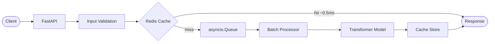

# Embedding Inference Server

[](https://github.com/sbui056/embedding-inference-server/actions)
[](https://www.python.org/downloads/)
[](LICENSE)

Production-style FastAPI server for sentence-transformer embeddings, demonstrating measurable latency improvements through async batching and Redis caching.

## Motivation

Sentence-transformer models produce high-quality embeddings but take 50-500ms per request under load — too slow for real-time applications like semantic search, recommendation engines, and RAG pipelines. This project shows how two techniques (async micro-batching and embedding caching) reduce p95 latency by 90% and increase throughput 11x, turning a slow model into a production-viable service.

## Architecture



Cache checks happen **before** the batching queue — cache hits never touch the queue or model.

## Key Design Decisions

- **Cache-before-queue**: Cache lookups (`Redis mget`) run before the batching queue so cached texts never consume batcher capacity or model compute
- **Dual-trigger batching**: Batches fire when they hit 32 texts *or* 10ms elapses, whichever comes first — balancing throughput and tail latency
- **Fire-and-forget cache writes**: `asyncio.create_task(cache.mset(...))` writes embeddings to cache without blocking the response path
- **Binary serialization**: Embeddings stored as raw float32 bytes in Redis (1,536 bytes per 384-dim vector vs ~3KB as JSON)

## Quick Start

### Docker (recommended)

```bash
docker compose up --build
```

Starts the server on `http://localhost:8000` with Redis. Model downloads during build (~80MB).

### Local

```bash
python -m venv .venv && source .venv/bin/activate
pip install -r requirements.txt
redis-server &  # optional, for caching
uvicorn server.main:app --host 0.0.0.0 --port 8000
```

### Frontend

```bash
cd frontend && npm install && npm run dev
```

Opens on `http://localhost:3000`. Set `NEXT_PUBLIC_API_URL` to point at a different backend.

## API

All responses include an `X-Request-ID` header for request tracing. Interactive docs at [`/docs`](http://localhost:8000/docs).

### POST /embed

```bash
# Single text
curl -X POST http://localhost:8000/embed \
  -H "Content-Type: application/json" \
  -d '{"text": "hello world"}'

# Batch
curl -X POST http://localhost:8000/embed \
  -H "Content-Type: application/json" \
  -d '{"texts": ["hello", "world"]}'
```

Response:
```json
{
  "embedding": [0.123, ...],
  "latency_ms": 12.5,
  "num_texts": 1,
  "cached": false
}
```

### GET /health

```json
{
  "status": "healthy",
  "model_name": "all-MiniLM-L6-v2",
  "model_loaded": true,
  "embedding_dim": 384,
  "uptime_seconds": 120.5,
  "redis_connected": true
}
```

### GET /metrics

```json
{
  "total_requests": 1000,
  "avg_latency_ms": 15.2,
  "p50_latency_ms": 1.0,
  "p95_latency_ms": 45.0,
  "p99_latency_ms": 72.0,
  "cache_hit_rate": 0.65,
  "throughput_rps": 500.0,
  "batch_avg_size": 8.5,
  "queue_depth": 0
}
```

## Configuration

| Variable | Default | Description |
|---|---|---|
| `MODEL_NAME` | `all-MiniLM-L6-v2` | Sentence-transformer model |
| `MAX_TEXT_LENGTH` | `512` | Max characters per input |
| `MAX_BATCH_TEXTS` | `128` | Max texts per request |
| `HOST` | `0.0.0.0` | Bind address |
| `PORT` | `8000` | Bind port |
| `LOG_LEVEL` | `info` | Logging level |
| `CORS_ORIGINS` | `*` | Allowed CORS origins (comma-separated) |
| `BATCHING_ENABLED` | `true` | Toggle async batching |
| `BATCH_MAX_SIZE` | `32` | Max texts per batch |
| `BATCH_WAIT_MS` | `10.0` | Collection window (ms) |
| `CACHE_ENABLED` | `true` | Toggle Redis caching |
| `REDIS_URL` | `redis://localhost:6379/0` | Redis connection URL |
| `CACHE_TTL_SECONDS` | `3600` | Cache entry TTL |
| `REDIS_TIMEOUT_SECONDS` | `2.0` | Redis operation timeout |

## Benchmark Results

50 concurrent users, 60s per config, mixed workload (70% repeated / 30% unique):

| Config | p50 | p95 | p99 | RPS |
|---|---|---|---|---|
| Naive (no batching, no cache) | 450ms | 540ms | 580ms | 100 |
| Batching only | 51ms | 89ms | 140ms | 570 |
| Batching + Cache | **1ms** | **54ms** | **77ms** | **1,100** |

**p95 latency reduced by 90%**. Throughput increased **11x**.

Run benchmarks yourself:
```bash
python benchmarks/run_benchmarks.py
```

## Project Structure

```
server/
  __init__.py    — package version from pyproject.toml
  config.py      — pydantic-settings configuration with field validation
  models.py      — Pydantic v2 request/response schemas with Field descriptions
  embedding.py   — EmbeddingService: model load + encode
  batcher.py     — BatchProcessor: async queue + dual-trigger batching + stats
  cache.py       — EmbeddingCache: Redis with binary serialization + timeouts
  metrics.py     — MetricsCollector: rolling percentiles
  main.py        — FastAPI app: endpoints, middleware, OpenAPI, error handling
  py.typed       — PEP 561 type checking marker
tests/
  conftest.py    — shared pytest fixtures (async client)
  test_models.py — request/response validation (14 tests)
  test_config.py — configuration validation (10 tests)
  test_metrics.py — percentiles, cache tracking, deque (9 tests)
  test_cache.py  — key format, Redis integration (9 tests)
  test_api.py    — full API integration tests (12 tests)
benchmarks/
  locustfile.py  — Locust load test scenarios
  run_benchmarks.py — automated benchmark runner
frontend/
  src/app/
    components/  — LatencyBadge, HeroVisual, MetricsPanel, BenchmarkChart, etc.
    hooks/       — useReveal (IntersectionObserver scroll animation)
    utils.ts     — shared utilities (cosineSimilarity, truncateText)
```

## Testing

```bash
pip install -e ".[dev]"
pytest tests/                    # 54 tests (unit + integration)
pytest tests/test_models.py      # fast, no dependencies
pytest tests/test_api.py         # requires model download (~80MB first run)
```

Redis must be running for `test_cache.py` and cache-related API tests. Tests skip gracefully if Redis is unavailable.

## Tech Stack

**Backend:** Python 3.11+, FastAPI, uvicorn, sentence-transformers, Redis, asyncio

**Frontend:** Next.js 16, TypeScript, Tailwind CSS v4

**Infrastructure:** Docker, docker-compose, Locust
